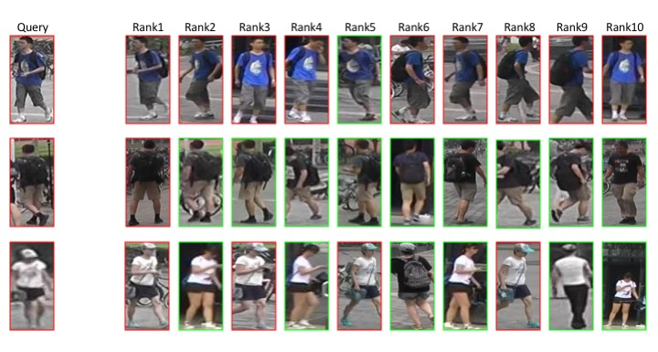
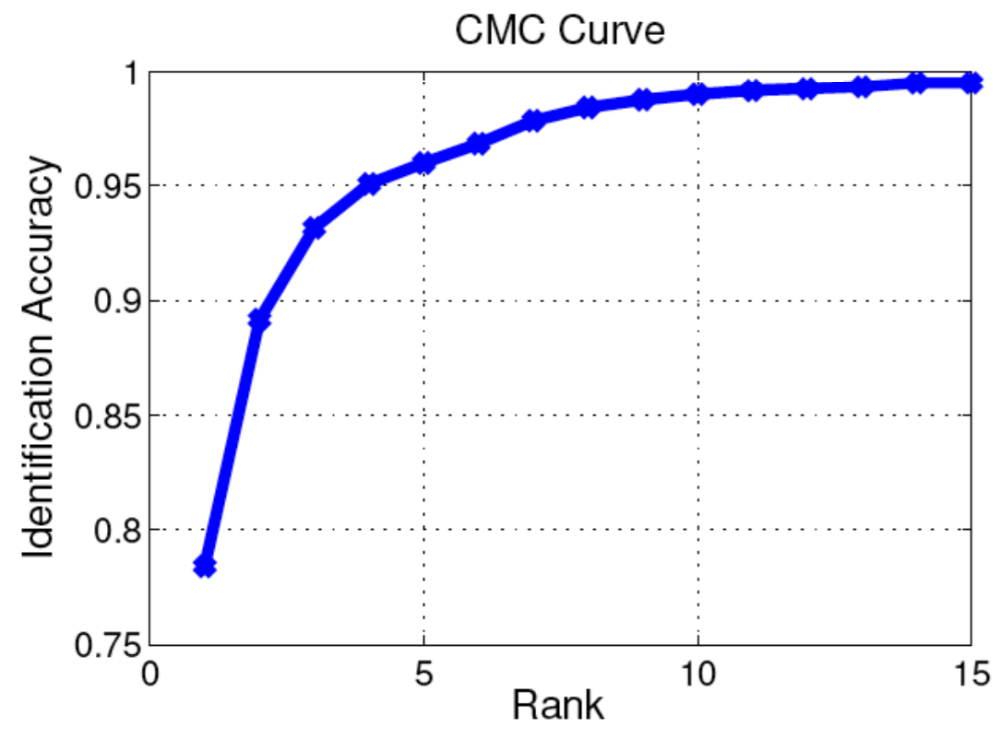
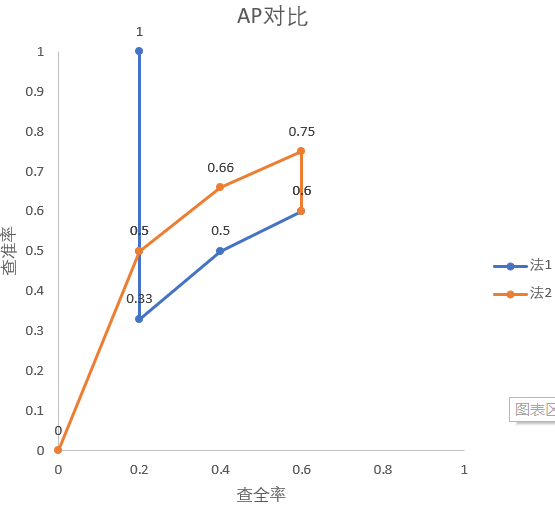
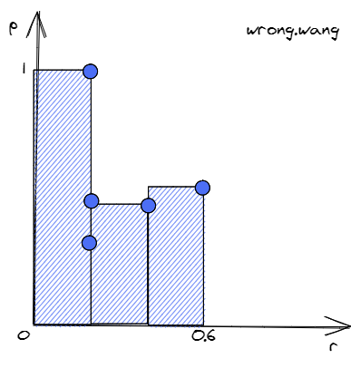
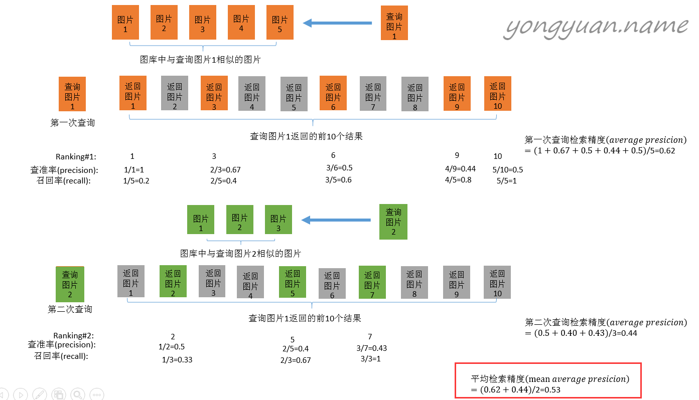

## ReID

ReID指Re-identification，常翻译为重识别。ReID任务本身分类很多，本文只讨论基于图片的ReID任务中`single-gallery-shot`这一最简单的情况。

重识别任务可以描述如下：

给定一个Gallery集合$G$，包含有$N$张图片，分属$M$个ID(identity)。给定一张未知ID的图片做query(或者叫probe), 计算出下式的结果：$max(Similarity(query, g_i)), i\in1,2,3,...,N, g_i\in G$。得到i之后，图片$g_i$对应的ID就是query的ID。大部分ReID相关的研究，都是在研究`Similarity()`这个函数，使得这个函数**在同ID时返回值高，不同ID时返回值低**。

下图就是一次典型的重识别任务:

为了更好地理解，我在这篇文中介绍一个新的重识别任务：*水果emoji重识别*。

我们现有一个水果emoji的数据集$G$：[🍍🍎🍎🍏🍍🍏🍎🍏🍍🍍🍍🍏🍎🍏🍍]，假定这个数据集中，即使是相同的emoji，图片也有细小的差别。
数据集一共包含$N=15$张图片，共有$M=3$种ID。任意给定一组query: [🍎,🍏]，从数据集$G$中找到和每个query最相近的5张图片(为了保证准确率，我们都是返回一组最相近的图片，而不是如前文所述的单独一张图片)。

我们现在有两个评价emoji之间相似程度的函数`Similarity1()`和`Similarity2()`。
对于query🍎，`Similarity1()`得到[🍍🍎🍎🍎🍏]，`Similarity2()`得到[🍎🍍🍎🍎🍏]。
对于query🍏，`Similarity1()`得到[🍏🍎🍍🍏🍏]，`Similarity2()`得到[🍎🍏🍏🍏🍍]。
得到的结果都按与query的相似度从左至右排列。那么`Similarity1()`和`Similarity2()`哪个得到的结果更好呢？

或者说：我们应该怎么度量`Similarity()`函数的性能？答案就是**CMC**和**mAP**。

## CMC

CMC是`Cumulative Matching Characteristics`的缩写，我个人把它翻译为`累计匹配特性`。ReID模型的好坏可以通过CMC曲线来评价。
为了计算CMC曲线，首先要把每次查询的结果按相似程度排序。接着，引入一个概念: $topK$准确度: $AccK$，其计算公式如下：
$$AccK=
\begin{cases}
1& \text{前K个结果中有同ID的结果}\\
0& \text{前K个结果中没有同ID的结果}
\end{cases}
$$
这里的K是一个从1开始增加的变量。显然，$AccK$形同单位阶跃函数。假设在查询得到的结果中，与query同ID的结果第一次出现时的排名为$F$，那么显然，$AccK$在$K=F$时，值由0变为1。
CMC曲线的计算方法就是，把每个query的$AccK$曲线相加，再除以query的总数，即平均$AccK$曲线。

回到我们的*水果emoji重识别*任务。
分别计算两个query的AccK曲线如下：

```text
Similarity    1          2
query🍎: 0 1 1 1 1 | 1 1 1 1 1
query🍏: 1 1 1 1 1 | 0 1 1 1 1
```

再平均各个query的AccK曲线，由此我们得到这两种相似度函数的CMC曲线都是[0.5，1，1，1，1]
由于query只有两个，所以得到的CMC的值有些简单。但是当query数足够大时，CMC曲线就会变成下图这样：

由于AccK曲线是一个单位阶跃函数，CMC曲线必定是一个单调递增的曲线。曲线上某个点如(R5, 0.96)就表示正确结果在前返回所有结果中排名前5的准确率能达到96%。
实际论文中，常取CMC曲线上的某几个点之间对比，比如常出现的Rank1，Rank5，就分别是CMC曲线上，K=1，5时的值。

## mAP

mAP是mean Average Precision的缩写。mAP涉及到的前置概念比较多：mAP是每个query的AP(Average Precision)的平均值，而AP又指Precision(准确率，又称查准率)的平均值。我们从头开始讲起。

对于ReID任务，我们经常关心两个问题：

1. 查询得到的结果中，和查询图片同一ID的结果占比多少?
2. 同一ID的图片中，有多大比例的图片被检索出来了?

这两个问题分别对应`查准率(precision)`和`查全率(recall)`，亦称作`准确率`和`召回率`。因为`准确率`这个称呼在别的领域有其它意义，为了防止误解，我还是喜欢用`查准率`和`查全率`的说法。

### 查准率和查全率

**查准率**就是和query同一ID的图片在查询结果中的占比。计算公式如下:
$$
precision = \frac{\mid\{同ID图片\}\cap\{查询结果\}\mid}{\mid\{查询结果\}\mid}
$$
查准率可以同时考虑所有的获取到的结果，也可以单独给定一个特定的值K，只考虑返回结果中排名前K的查询结果，在这种情况下，查准率又可以称为前K查准率，记作P@K。

**查全率**就是和query同一ID的图片出现在查询结果中的数量占总数的比例。计算公式如下：
$$
recall = \frac{\mid\{同ID图片\}\cap\{查询结果\}\mid}{\mid\{同ID图片\}\mid}
$$
查准率和查全率看上去都很有意义，但我们能直接用它俩来评判ReID模型的性能了吗？当然不行，由于查准率和查全率都是通过比例来计算，完全忽略了返回结果的排序！当查询🍏时，返回🍏🍏🍏🍎🍍和🍎🍍🍏🍏🍏当然是不一样的，但其查准率和查全率却是一样的。返回结果的顺序被忽略了。

值得注意的是，查准率和查全率是一个相互矛盾的度量，比如为了增加查全率，我们可以通过增加查询结果的数量来实现，当查询结果数量等于数据集大小时，查全率一定等于1，因为这时所有图片都被查询得到了。但此时查准率就成了最小值。所以比较模型的性能不是那么简单的事情。

### P-R曲线图

那怎么比呢？肉眼比对时，我们常从结果的第一个开始，一个一个比对。借鉴这种思路，我们可以逐渐增加查询结果的数量，从第一个开始，一直到系统给出的查询结果的最后一个，把中间每个点对应的查准率和查全率计算出来然后绘制到一张图上。

我们接着拿水果emoji重识别任务做例子，对于query🍏，`Similarity1()`得到[🍏🍎🍍🍏🍏]，`Similarity2()`得到[🍎🍏🍏🍏🍍]。我们现在首先绘出此时两种方法的P-R曲线。注意，由前文的任务定义得$\mid\{同ID图片\}\mid=5$

| 序号 | Similarity1 |        | Similarity2 |        |
|:------:|:-----------:|:------:|:-----------:|:------:|
|      |    查全率   | 查准率 |    查全率   | 查准率 |
| 1    |     0.2     |    1   |      0      |    0   |
| 2    |     0.2     |   0.5  |     0.2     |   0.5  |
| 3    |     0.2     |  0.33  |     0.4     |  0.66  |
| 4    |     0.4     |   0.5  |     0.6     |  0.75  |
| 5    |     0.6     |   0.6  |     0.6     |   0.6  |

接着将这些点绘制在一张图上：



由于5个点太少，上图中曲线还没表现出明显的趋势。实际上，在查询量足够大时，P-R图一般都类似于下图：


P-R图直观地显示出了ReID模型的查全率和查准率，显而易见，如果一个模型的P-R曲线包住了另一个模型的P-R曲线，这个模型的性能就好于另一个模型。

### Average Precision

显然，PR曲线与坐标轴围起来图形的面积一定程度上反应了ReID模型的性能，我们把这个面积叫做Average Precision。这个面积怎么求？由积分知识可得:
$$
AveP = \int_{0}^1p(r)dr
$$
可惜，我们得到的是曲线上一个个点，得不到$p(r)$的准确公式，没法用上面的公式计算。但计算AP的过程已经可以被归结为这么一个问题：

*假设一共返回$N$个查询结果，计算N个点$\{(recall_k, precision_k), k\in1,2,3,...,N\}$的离散积分。*

显然，可以用多个长方形条的面积之和表示积分结果。
$$AveP = \sum_{k=1}^{N}precision_i(recall_k-recall_{k-1})$$

拿水果emoji重识别中的查询为🍏时的`Similarity1`做个例子：



注意，图中r一致，p在变小的前3个点中，只有p最大的点对计算积分值有影响。因为只有此时$recall_k-recall_{k-1}$值不为0。这样，我们得出一个结论，计算积分时，只需要考虑查准的结果处(假设为第$k$个查询结果)对应的$(recall_k, precision_k)$。

可以这么理解，返回结果[🍏🍎🍍🍏🍏]中第2，3个结果都没查准，那么前2，3个结果中查准个数不变，即recall保持不变，recall保持不变意味着这几个点在P-R图中，位于同一条平行于p轴的直线上。由于$recall_k-recall_{k-1}=0$，它们不影响积分结果。

所以如果令集合$\Omega$为和query同ID的第k个查询结果的集合，$N_t$为所有与查询图片同ID的图片数目，$\Delta recall=1/N_t$：
$$AveP = \sum_i precision_i\Delta recall, i\in\Omega$$
对于查询结果[🍏🍎🍍🍏🍏], $\Omega=\{1,4,5\}$，$\Delta recall=1/5$。


网上搜mAP相关教程时经常出现的图片(来自[yongyuan.name](http://yongyuan.name/blog/evaluation-of-information-retrieval))用的就是这个公式。



为了计算AP更精确，我们也可以用梯形面积公式替换矩形面积：
$$
AveP = \sum_{k=1}^{N}\frac{precision_k+precision_{k-1}}{2}(recall_k-recall_{k-1})
$$

同前面的讨论一致，我们也可以只计算查准点的梯形面积：

$$AveP = \sum_i \frac{precision_i+precision_{i-1}}{2}\Delta recall, i\in\Omega$$

另外，第0个结果的查准率本来是无意义的，但是为了计算方便，补充定义$precision_0=precision_1$。

> **注意**：$precision_{i-1}$不是$\Omega$集合中的上一个点的查准率，而是第i-1个查询结果对应点的查准率。
>
> 详细分析附在了文章最后。

无论是梯形还是矩形，两个公式都可以计算AP，但后一个公式精确度更高一些。

最后，平均一下每个query的AP值就得到了mAP。
$$mAP = \frac{\sum_{i=1}^{N_q}AveP_i}{N_q}$$

### 水果emoji重识别任务

再回到我提出的水果emoji重识别任务，我们来计算下两种方法的mAP：

我们现在有两个评价emoji之间相似程度的函数`Similarity1()`和`Similarity2()`。
对于query🍎，`Similarity1()`得到[🍍🍎🍎🍎🍏]，`Similarity2()`得到[🍎🍍🍎🍎🍏]。
对于query🍏，`Similarity1()`得到[🍏🍎🍍🍏🍏]，`Similarity2()`得到[🍎🍏🍏🍏🍍]。

对于`Similarity1()`：

query为🍏时，$AP=\frac{1+1}{2}*\frac{1}{5}+\frac{0.33+0.5}{2}*\frac{1}{5}+\frac{0.5+0.6}{2}*\frac{1}{5}=0.393$

query为🍎时，$AP=\frac{0+0.5}{2}*\frac{1}{5}+\frac{0.5+0.66}{2}*\frac{1}{5}+\frac{0.66+0.75}{2}*\frac{1}{5}=0.307$

那么$mAP=\frac{0.393+0.307}{2}=0.35$

对于`Similarity2`，同理可计算，🍎：$AP=0.457$，🍏：$AP=0.307$，$mAP=0.382$。

所以我们最终得到，`Similarity2()`优于`Similarity1()`。

## 代码实现

相信你在理解了mAP和CMC之后，再用代码实现它俩就变得很轻松了。我最近一直在做行人重识别的项目，可以拿我一直在用的[evaluate.py](https://gist.github.com/budui/ba3b2c5868f7d68982191be7db32b453#file-evaluate-py-L28)中的`evaluate_with_index()`函数做一个参考。

## One More Thing：

我起初把$precision_{i-1}$错误地理解为集合$\Omega$的前一个值对应的准确率，因此实现代码时计算$precision_{i-1}$用的是下面这个公式：

```python
old_precision = float(i) / (right_index_location[i-1]+1)
```

这里和一个千star级别的repo[Person_reID_baseline_pytorch](https://github.com/layumi/Person_reID_baseline_pytorch)不一致，我还以为人搞错了，还发了一个[issue](https://github.com/layumi/Person_reID_baseline_pytorch/issues/110)。和@[layumi](https://github.com/layumi/)讨论半天才发现我错在哪了。其实问题关键就是$precision_{i-1}$究竟是什么。比如当$\Omega=\{1,4,5\}，i=4$时，$precision_{i-1}=precision_3$，而不是$\Omega$中的前一个index 1。

正确的算法应该是

```python
old_precision = float(i) / (right_index_location[i])
```
