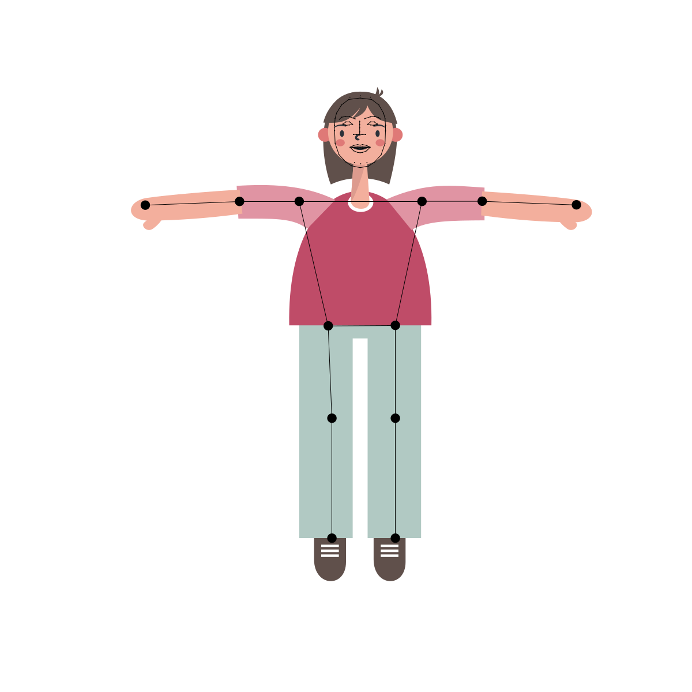
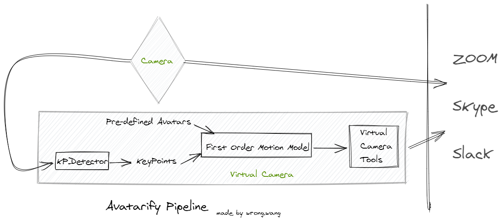
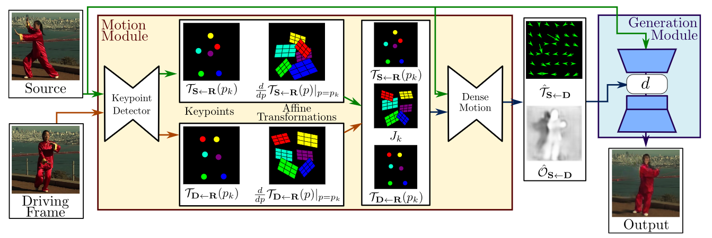

疫情肆虐期间大家被限制在家中，只能远程工作，远程会议。散落在各地的程序员也同样如此，整天面对笔记本的摄像头工作，催生出两个利用笔记本摄像头和AI实现的小项目。这俩项目很有趣，同时和我研究生在做的课题比较接近，于是我粗略地研究了一下他们的方案，和大家分享一下这两个Motion Transfer项目。

## [Pose Animator](https://github.com/yemount/pose-animator)

`Pose Animator`可以让2D矢量图动起来。它使用基于`TensorFlow.js`的`PoseNet`和`FaceMesh`，能够在浏览器上实时提取视频中人物关键点，并基于此关键点**实时**生成对应动画。`Pose Animator`实现*Motion transfer*主要基于骨架(skeleton)，将真人姿态关键点（由`PoseNet`得到）和人脸表情关键点（由`FashMesh`得到）直接与矢量图的关键点一一对应起来。这样无论人做什么动作，矢量图也能对应地完成动作。

目前repo提供了两种在线测试的方法，可以去试试：1. [Camera feed](https://pose-animator-demo.firebaseapp.com/camera.html)，2. [Static image](https://pose-animator-demo.firebaseapp.com/static_image.html)

上图比较清楚地展现了全流程。使用建立在`TensorFlow.js`上的两个js库[@tensorflow-models/posenet](https://www.npmjs.com/package/@tensorflow-models/posenet)和[@tensorflow-models/facemesh](https://www.npmjs.com/package/@tensorflow-models/facemesh)，能很迅速地提取出输入图片的人脸关键点和姿态关键点。这里最让我惊奇的就是`TensorFlow.js`，能在浏览器里运行AI模型，这两个模型甚至都不需要GPU就能做到实时输出关键点，这么小的资源消耗，这么快的响应速度，相当惊人！

显然这个小项目的核心在于关键点(keypoints)。怎么提取它、怎么建立它和SVG的动画的对应关系这两个任务一完成，这个项目就成功了大半。作者用到的关键点如图所示：

`TensorFlow.js`上的两个js库[@tensorflow-models/posenet](https://www.npmjs.com/package/@tensorflow-models/posenet)和[@tensorflow-models/facemesh](https://www.npmjs.com/package/@tensorflow-models/facemesh)这两个库分别输出[17个](https://www.npmjs.com/package/@tensorflow-models/posenet#keypoints)（12个姿势关键点+5个人脸关键点），[438个](https://drive.google.com/file/d/1VFC_wIpw4O7xBOiTgUldl79d9LA-LsnA/view)人脸关键点。这个项目只用到了其中的12个姿态关键点（图中的大黑点），和71个人脸关键点（图中的小点）。可以右键查看上面这个SVG文件的代码，其中有`id`的`circle`标签就是关键点。半径为0.6的是人脸关键点，半径为8.2的是姿态关键点。

接着以关键点作为骨架，在其基础上绘制真正的动画：

每次动作发生改变时，用提取的姿态点信息修改动画骨架的姿态，对应的动画形态也发生变化。

这个项目只能把姿态迁移到最简单的动画上，这些动画实际上只是SVG文件中的一些`path`标签，意味着动画必须是矢量的。这是基于关键点骨架的原理所限，不容易克服。下面介绍一个似乎更通用的项目。

## [avatarify](https://github.com/alievk/avatarify)

`avatarify`可以让预定义的头像跟随输入动起来，配合一些工具可以将输出流虚拟成一个摄像头的输出，这样使用一些视频会议应用时，可以选择虚拟的摄像头，你的同伴们看到的你就是预定义的头像那个样子了。

常见的网上会议软件如ZOOM，Skype，Slack，均支持选择摄像头，这个项目就是利用了这一点：只要虚拟出一个摄像头来，上层应用都可以直接用了。不同平台有不同的摄像头虚拟化工具，如linux下是`v4l2loopback`，但完成的任务都一样：`Avatarify`接收真正的相机输出的视频流，逐帧处理视频流，输出一个视频流，然后摄像头虚拟化工具包装前面输出的视频流为一个虚拟相机。

`Avatarify`其实只是一个把所有现成的东西组装起来的项目（有组装这个idea就很牛！），它的代码才500行左右。其最关键的*Motion Transfer*是直接使用的论文[First Order Motion Model for Image Animation](https://papers.nips.cc/paper/8935-first-order-motion-model-for-image-animation.pdf)的代码。

这篇文章发表在NIPS2019上，[论文代码](https://github.com/AliaksandrSiarohin/first-order-model)也已经拿了3.7千个star，相当厉害。这个模型首先用自监督的方法训练一个Keypoints Detector，能够生成图片的keypoints以及keypoints周围的局部仿射变换(*local affine transformations*)，接着计算出从驱动帧到源图的光流图和遮挡图，再加上源图本身，送入生成器，生成有驱动帧动作的源图形象。

使用Deep Learning就意味着需要GPU支持。这个项目的README中说使用`GTX 1080Ti`才能达到33 fps，如果只有CPU，比如在MBP2018上，大概只能有1fps，一秒才能处理一帧，完全没法用。*Motion Transfer*或者说*Video re-targeting*是目前很活跃的一个领域，论文层出不穷。如果以后有了更先进的AI模型，`Avatarify`的代码切换使用新模型很简单。就是不知道占用资源更小、效果更好的模型什么时候出现。

这两个项目的思路、代码都不是很复杂，但实现的效果都很惊艳，都在短时间内吸引了大量star，社交媒体上也一堆人自发推广。有个好的idea多么重要啊！

