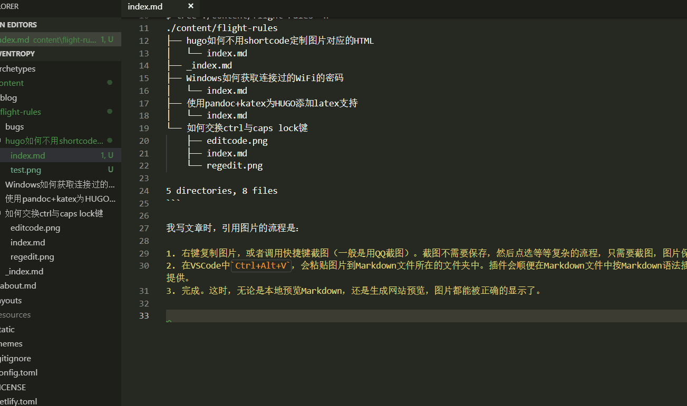

对我来说，静态博客的图片管理需要满足以下几个需求：

1. 方便引用，插入图片时怎么简单怎么来；
2. 方便备份，图片最好存在多处，防止图片丢失；
3. 方便管理，可以用程序自动上传到多个地方；
4. 保证速度，图片最好有CDN，加载不要太慢。

## 文件组织

我的网站使用的生成器是hugo。为了方便地引用，保存图片，我现在采用如下的文件组织形式：

```bash
$ tree ./content/flight-rules -n
./content/flight-rules
├── hugo如何不用shortcode定制图片对应的HTML
│   └── index.md
├── _index.md
├── Windows如何获取连接过的WiFi的密码
│   └── index.md
├── 使用pandoc+katex为HUGO添加latex支持
│   └── index.md
└── 如何交换ctrl与caps lock键
    ├── editcode.png
    ├── index.md
    └── regedit.png

5 directories, 8 files
```

图片被存储在markdown文件所在的文件夹中。方便管理。同时，在git仓库中存一份图片可以当作图片的备份，以防特殊情况下图床上的图片丢失。

## 引用图片

引用图片时使用的路径要方便之后按照一定的规则替换路径。我将Markdown文件和图片放在同一个文件夹中，引用图片时直接用图片文件名即可。

我写文章时，引用图片的流程是：

1. 右键复制图片，或者调用快捷键截图（一般是用QQ截图）。截图不需要保存，然后点选等等复杂的流程，只需要截图，图片保存到剪贴板就可以了。
2. 在`VSCode`中`Ctrl+Alt+V`，会粘贴图片到Markdown文件所在的文件夹中。插件会顺便在Markdown文件中按Markdown语法插入图片。这项功能由`Markdown Paste`插件提供。

这时，无论是本地预览Markdown，还是生成网站预览，图片都能被正确的显示了。

我截图并引用一张图片的全流程：


看起来还是比较方便的。目前面临的最大的问题是：我老忘记`Ctrl+Alt+V`这个快捷键。

另外，著名的Markdown编辑器[Typora](https://typora.io/)也支持插入图片时自动将图片复制到当前文件夹，可以直接`Ctrl+V`插入、复制图片。
如果不喜欢用VScode写Markdown文件，可以用Typora。

## 图片访问加速

由于Markdown中的图片路径是相对路径形式，访问网站时图片从静态网站托管商那里获取，常用的Github Pages和Netlify在国内的速度都不行，能不能把图片上传到图床中，并把HTML中图片的链接替换为图床链接呢？完全可以！

### 上传图片到图床

原始图片和markdown文件存放在一起，会被一起推送到github的仓库中。如果懒得花钱用腾讯，阿里，七牛的对象存储+CDN搭建图床，可以直接用免费的jsDelivr，据说在国内有节点，速度还很快。因为我是腾讯云的老用户，有腾讯云对象存储和CDN永久免费的10G额度，不用白不用，我的图床是腾讯云的COS+CDN。

jsDelivr只需要你将图片push到GitHub仓库中，就可以直接用它的CDN访问仓库中的图片。具体规则如下：
一张图片在github仓库(budui/wrong.wang)中路径为`content/blog/175天/浙大鸡.png`，那么可以直接用
`https://cdn.jsdelivr.net/gh/budui/wrong.wang/content/blog/175天/浙大鸡.png`来访问它。非常方便。

如果是腾讯云的COS图床或者其它类似的对象存储服务，需要利用Github Action在每次Push时把图片自动上传到COS，幸运的是腾讯云官方提供了coscmd作为命令行上传工具，因此Github Action的[配置文件](https://github.com/budui/wrong.wang/blob/master/.github/workflows/uploadcos.yml)非常好写。最简单的思路是先安装coscmd，再用coscmd一行命令upload就完事~。因为除了用CDN做图床，本站的CSS，JS等相关文件也通过CDN访问，我的配置文件还加入了用hugo生成网站这一步，接着将整个网站中能用CDN加速的内容全部上传。关键的上传命令就下面这一行：

```bash
coscmd upload -rs --delete -f --ignore "*.html,*.xml" -H "{'Cache-Control':'public, max-age=7776000'}" ./public/ /
```

这样本站中图片链接的形式如下`https://<CDN地址>/blog/20190315-175天/浙大鸡.png`

### 替换图片src

在替换src时，需要首先拼接出图片的链接。图片链接由CDN部分的路径+图片所在文件夹+图片文件名构成。其中图片所在文件夹有两种路径形式，一种是Hugo生成前的路径，即和markdown文件放在一起的图片的文件夹路径，一般都是`/content/`开头；另一种是和html文件放在一起的图片文件夹路径，是hugo生成网站后产生的。这两种路径在Hugo中分别对应`.Page.File.Dir`和`.Page.RelPermalink`。显然，前文所示的jsDelivr路径就是由`jsDelivr BaseURL`+`.Page.File.Dir`+`图片名`构成，COS图床的图片链接就是`<CDN地址>`+`.Page.RelPermalink`+`图片名`。

在Hugo0.62之前，如果要替换图片src，需要用hugo提供的正则替换功能，用正则替换掉原本的img标签。可用，但不是那么方便。在0.62版以后，Hugo引入了[Markdown Render Hooks](https://gohugo.io/getting-started/configuration-markup#render-hook-templates)功能，可以自己编写渲染图片和链接的逻辑，非常方便。



Hugo处理Markdown后得到的图片tag输出一定是``这样的形式，我们可以用正则提取出src和alt甚至title部分(如果有的话)，然后重新组织生成的``tag。Hugo中，正则替换的函数是[replaceRE](https://gohugo.io/functions/replacere/)。

几乎所有的hugo主题，导入由Markdown文件转换得到的HTML内容的代码是`layouts/_default/single.html`中`{{ .Content }}`。
把`{{ .Content }}`替换为以下代码：

```text
{{ if .Site.Params.CDN.enable }}
    {{ $reAltIn := "" }}
    {{ $reAltOut := (printf "" .Site.Params.CDN.Host .Dir )}}
    {{ $altContent := .Content | replaceRE $reAltIn $reAltOut | safeHTML }}

    {{ $reAltTitleIn := "" }}
    {{ $reAltTitleOut := (printf "" .Site.Params.CDN.Host .Dir )}}
    {{ $finalContent := $altContent | replaceRE $reAltTitleIn $reAltTitleOut | safeHTML }}

    {{ $finalContent }}
{{ else }}
    {{ .Content }}
{{ end }}
```

然后在`config.toml`中加入相应的参数内容：

```toml
[params.CDN]
enable = true
# Host must end with `/`
Host = "https://lowentropy.jinxiapu.cn/img/"
```

图片的src就由`test.jpg`被替换为`https://lowentropy.jinxiapu.cn/img/{{ .Dir }}/test.jpg`，这里的{{ .Dir }}是Markdown文件相对于content文件夹的地址。可以按照自己的喜好更改。



现在，直接新建`layouts/_default/_markup/render-image.html`，并写入如下内容即可：

```html
{{- $img_destination := .Destination }}
{{ if (and .Page.Site.Params.CDN.enable (not .Page.Site.IsServer)) }}
    {{ $img_destination = (print .Page.Site.Params.CDN.HOST (path.Join .Page.RelPermalink .Destination)) }}
{{ end }}


```

在配置文件`config.toml`中新建一项：
```toml
[params.CDN]
enable = true
# Host must NOT end with `/`
Host = "https://wrong-wang-1251968348.file.myqcloud.com"
```

非常方便。详细的方案可以参考我的[博客仓库](https://github.com/budui/wrong.wang/)，主要看文件[render-image.html](https://github.com/budui/wrong.wang/blob/master/themes/hugo-w2ng/layouts/_default/_markup/render-image.html)和[Github Action](https://github.com/budui/wrong.wang/blob/master/.github/workflows/uploadcos.yml)。