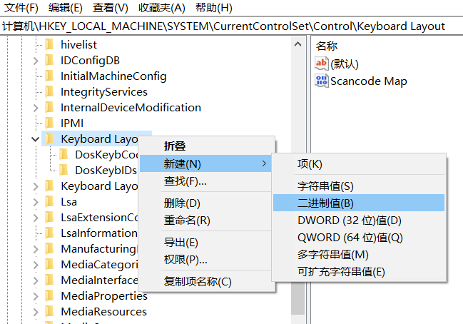
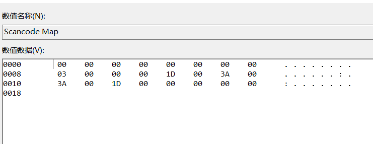

最近准备尝试下交换CTRL与Caps lock键。已经有很多交换这两个按键的方式。但大都不太满足我的要求：最好不装软件，最好很容易恢复到原来的样子。

## Windows下

Windows下有两张蛮方便的方法，第一种是直接修改注册表，第二种方法是用一个专门的软件。

### 修改注册表

最后发现还是用windows自带的注册表做这件事比较方便：

1. Windows+R 打开`运行`
2. 输入`regedit`，打开注册表管理器。
3. 定位到`HKEY_LOCAL_MACHINE\SYSTEM\CurrentControlSet\Control\Keyboard Layout`，注意，这里是`Keyboard Layout`而不是`Keyboard Layouts`。
4. 新建二进制值：`Scancode Map`
   
5. 右键编辑这个二进制值为

```plaintext
00 00 00 00 00 00 00 00
03 00 00 00 1d 00 3a 00
3a 00 1d 00 00 00 00 00
```

编辑时可能有点不顺手，不用害怕，反正最终效果如下：



最后重启电脑就好了！

补充下上面的数字的意思：

注意阅读数字时，每4个为一组。

* `00 00 00 00`是`header version`，永远是0。
* `00 00 00 00`是`header flag`, 永远是0。
* `03 00 00 00`是指要改变的键数以及最后肯定要加的NULL终止符，这里就是3了。
* `1d 00 3a 00`中，`0x001d`是`LEFT CTRL`的代码，`0x003a`是`CAPSLK`的代码，这串数字表示按下`0x003a`时发送`0x001d`。
* `3a 00 1d 00`则与上述相反，按下`0x001d`时发送`0x003a`。这样我们就交换了这两个按键。
* NULL终止符行，对应第3组里3代表的第3行。

如果你不想交换这两个按键了，比如我现在，就不太想交换了。就把上面新建的这个注册表项删掉重启好了。

### 神秘软件

直接修改注册表总不是很方便，而且要预先获取各种键的二进制编码。我目前在Windows上直接使用[sharpkeys](https://github.com/randyrants/sharpkeys)来交换按键。按照其ReadMe上的教程下载安装软件，然后直接选择需要交换的按键就好了，这个软件做的很方便顺手。

我目前在Windows上将Caps键和右Ctrl键交换了位置。我在Windows上基本不用vim，所以没有调换Esc键的位置。

## Linux下

这个方法修改自一个[gist](https://gist.github.com/tanyuan/55bca522bf50363ae4573d4bdcf06e2e)

首先要安装[xcape](https://github.com/alols/xcape)。

然后我做了如下设置：

```bash
# 将Caps替换为CTRL
setxkbmap -option ctrl:nocaps
# 将同时按下左右shift替换为Caps
setxkbmap -option shift:both_capslock
# make short-pressed ctrl behave like Escape
# 单独按下Caps表示Escape，Caps+其它键时表示Ctrl
xcape -e "Control_L=Escape"
```

在shell中运行这三行命令后，Caps键在单独按下时就是ESC，在配合其它键按下时就是CTRL，非常方便。另外，因为替换Caps后仍然有切换大小写的需求（虽然大部分时候我只用shift+字母来输入大写），我指定同时按下两个shift键为Caps Lock。

剩下的就是开机自动执行这三行命令了，可以将这三行代码放入`~/.xprofile`中。值得提示的是，切忌把这三行代码直接放入`.profile`，否则会导致每次开启shell都会运行这三行命令，最好将其放入只在桌面启动时才会执行的文件中，不同桌面可能有不同的配置位置。
